# 这是一个没有git初始化的项目

git不需要ai,它和ai没有任何关系,它比ai要早几十年,和linux是同一个作者

# 首选需要git初始化项目,这个项目才能被git管理
git init
注意该命令执行的目录,就是项目根目录
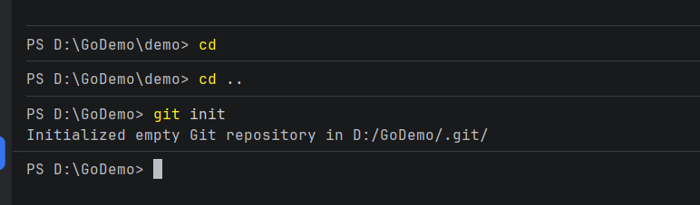

# git主要命令:
## git add .
该命令将你的修改保存到git缓存区

## git commit -m "本次修改的内容"
该命令正式提交了你的修改,执行了此操作后,如果以后发现代码出现了严重错误需要立刻恢复,

可以直接回退到该位置(是团队任何人都可以回退到该位置)
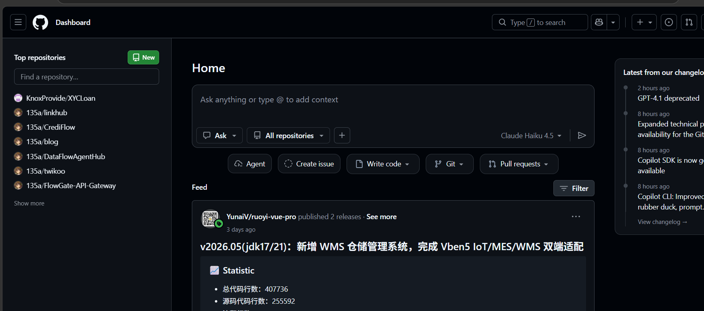

## git push
该命令可以将你的代码推送到远程仓库,即github仓库,任何人(主要是你团队的人可以拉下来,可以设置为代码权限,阅读、修改之类的)
其实也不一定是github,github只是最经典的,大部分人都在用的,你也可以推送到其它地方,比如Gitee,比如你自己的服务器上等等

这里报错了,因为远程仓库根本没有你这个项目

所以我们需要到远程仓库建一个:
点击new

仓库名称、可见性自己设置
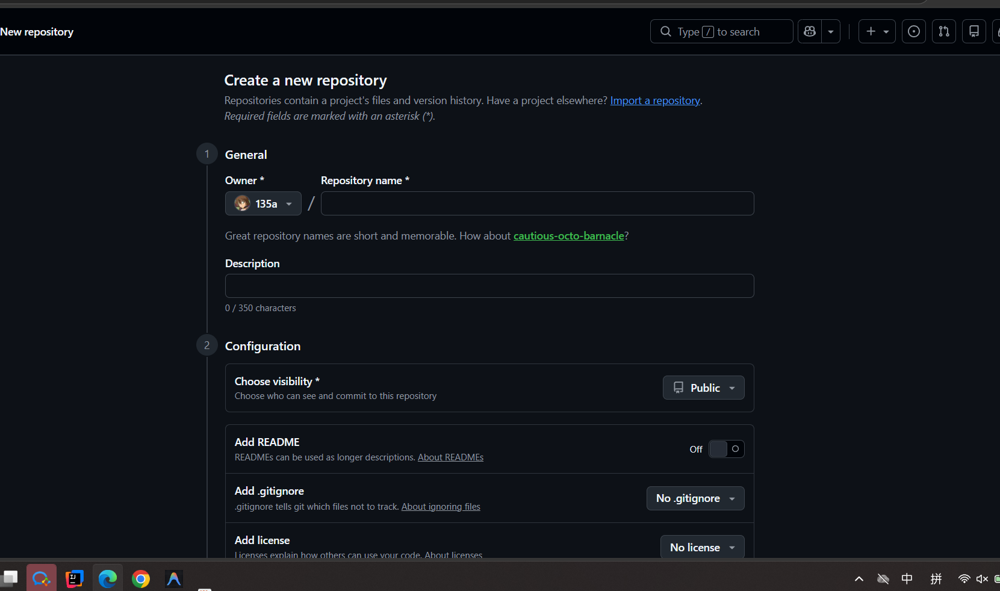

建好了
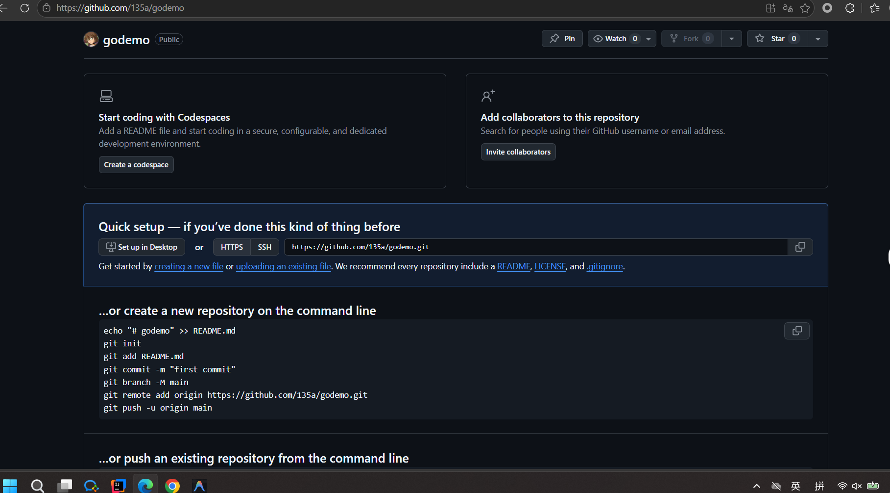

# git remote add origin https://github.com/135a/godemo.git

把自己的项目和远程仓库关联起来

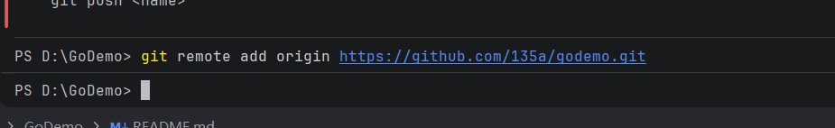

# git branch -M main
重命名本地分支,可选,
一个项目有很多分支,供不同团队开发
比如大厂规范:
dev开发分支
main线上分支,客户正在使用的、正在运行的分支、不能动、一般情况下你也没有权限动
fix修改bug分支
...

# 再次提交push

注意:如果你有尚未保留在git缓存的东西,必须先add、commit再Push

远程仓库是新建的,本来就没有任何分支,直接一次性绑定即可`git push --set-upstream origin main`
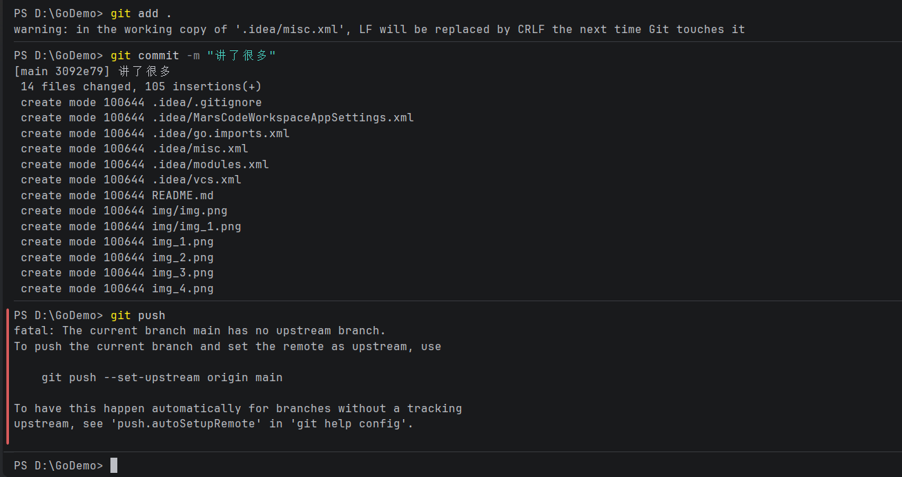

现在:
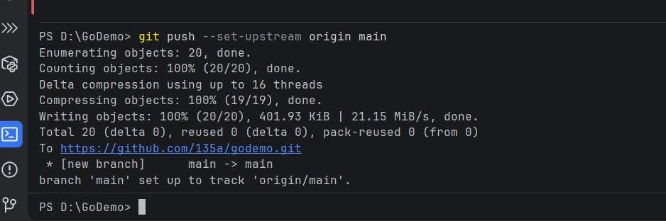
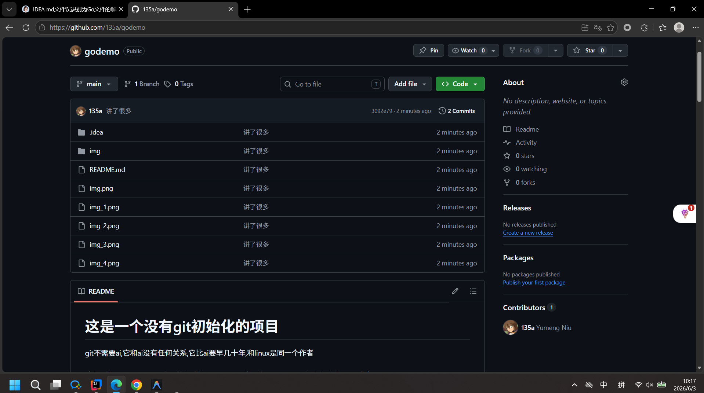
推送完成

# 如果你不喜欢命令行
idea提供了很多插件可以使用
点击提交相当于git add .+git commit -m "...",
点击提交并推送相当于:git add .+git commit -m "..."+git push
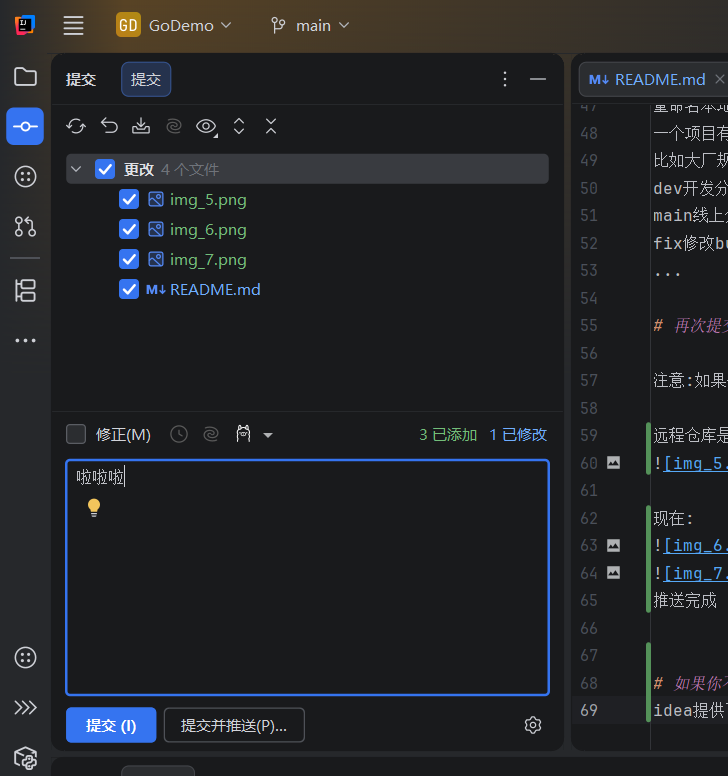

# commit 后的注释是必写的,如果懒得写,可以自己找个插件，接入ai,自动生成

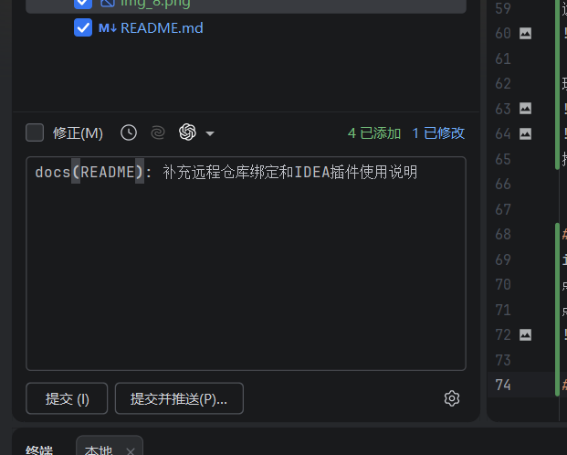

# 关于分支
在仓库新建一个分支:
点击branch再点击New,
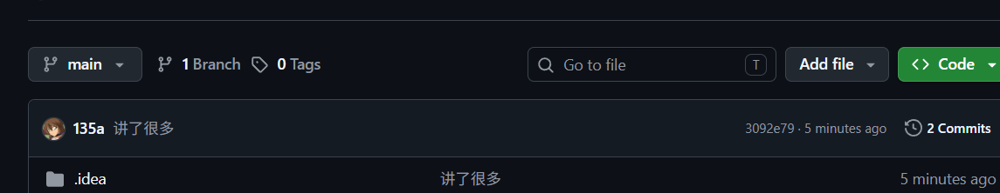
创建选项有个main,是在问你，你的新分支的初始代码从哪个分支拉，我们暂时只有一个分支不用管
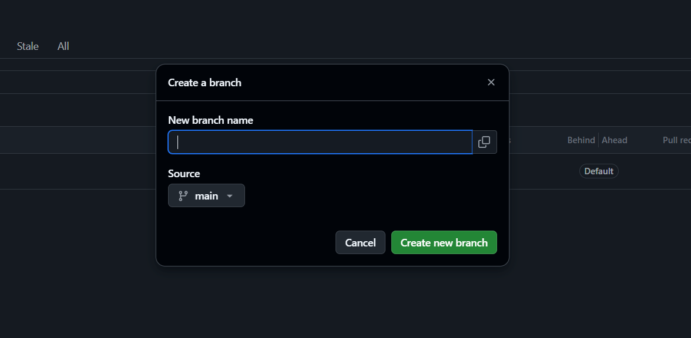
创建完成
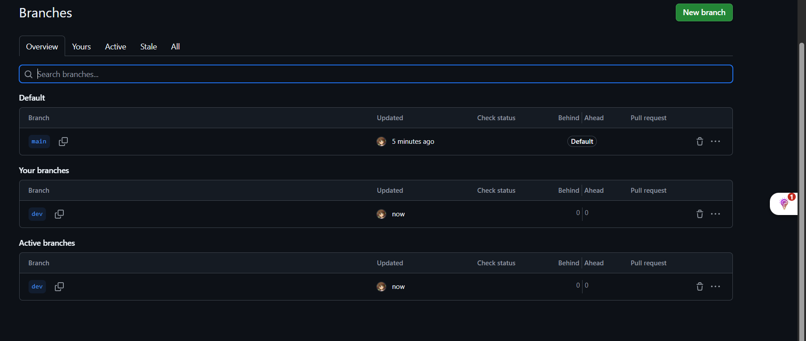
# 我们测试一下分支
新建一个文件并推到远程仓库
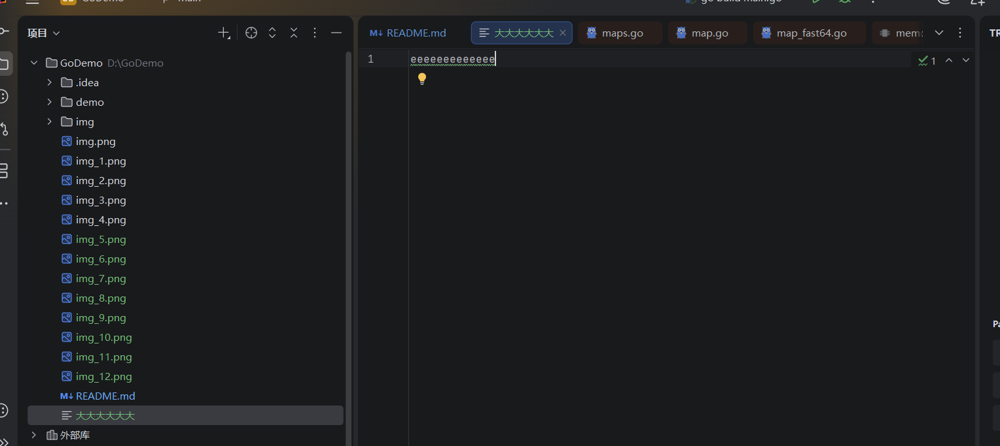

# 我们切换到dev分支
先执行git fetch 把远程最新信息拉下来
git switch dev
